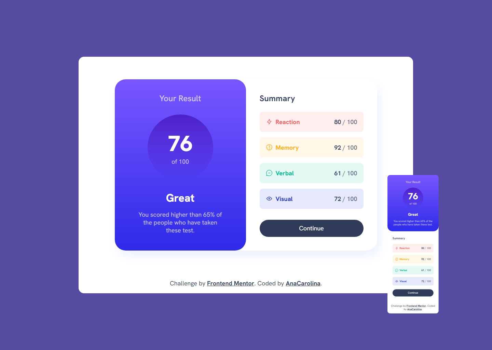

# Frontend Mentor - Results summary component solution

This is a solution to the [Results summary component challenge on Frontend Mentor](https://www.frontendmentor.io/challenges/results-summary-component-CE_K6s0maV). Frontend Mentor challenges help you improve your coding skills by building realistic projects.

## Table of contents

- [Overview](#overview)
  - [The challenge](#the-challenge)
  - [Screenshot](#screenshot)
  - [Links](#links)
- [My process](#my-process)
  - [Built with](#built-with)
  - [What I learned](#what-i-learned)
  - [Continued development](#continued-development)
  - [Useful resources](#useful-resources)
- [Author](#author)

## Overview

### The challenge

Users should be able to:

- View the optimal layout for the interface depending on their device's screen size
- See hover and focus states for all interactive elements on the page
- **Bonus**: Use the local JSON data to dynamically populate the content

### Screenshot

### Links

- Solution URL: [https://github.com/AnaCarol2001/ResultsSummaryComponent](https://github.com/AnaCarol2001/ResultsSummaryComponent)
- Live Site URL: [https://anacarol2001.github.io/ResultsSummaryComponent/](https://anacarol2001.github.io/ResultsSummaryComponent/)

## My process

### Built with

- Semantic HTML5 markup
- CSS custom properties
- Flexbox
- CSS Grid
- Mobile-first workflow
- [React](https://reactjs.org/) - JS library
- [Vite](https://vitejs.dev/) - build tool for web projects

### What I learned

Since this project is relatively simple, it was an opportunity to learn the basics of React JS. So, I learned about component architecture - how to break the design into small components and compose them into a bigger one, making the components more reusable. I also learned how to dynamically render a list of components using an array and its method Map and to use the Context Hook to share the heading level with different components without passing it as props.
Adding styles was also something that I learned, and aside from React, CSS animation was something that I dived into to figure out how to make the sequence animation of this project, using CSS variables and the calc property in the animation delay to make the sequence work.

### Continued development

I still have to improve how to structure a React project properly, which was one of the challenges I faced during this project. I also want to work with other React hooks to learn more about React and its capabilities. Besides that, I want to explore CSS frameworks and animation libraries.

### Useful resources

- [JavaScript frameworks and libraries - Frontend Mentor](https://www.frontendmentor.io/learning-paths/javascript-frameworks-and-libraries-JDWoqQjMyb) - this project is part of this learning path.
- [Heading Levels in Reusable Components](https://www.upyoura11y.com/reusable-components-with-headers/) - helped me comprehend how to make reusable components without leaving accessibility aside.
- [Passing Data Deeply with Context](https://react.dev/learn/passing-data-deeply-with-context) - a React article about Context Hook.
- [Implementando Composition Pattern em aplicações React](https://vinniciusgomes.medium.com/implementando-composition-pattern-em-aplicacoes-react-4e8dc92742ff) - a good example of how to use the composition pattern.
- [Different Approaches for Creating a Staggered Animation](https://css-tricks.com/different-approaches-for-creating-a-staggered-animation/) - helped me figure out how to do the list animation.
- [From Design to Code // HTML & CSS from scratch // Frontend Mentor](https://youtu.be/KqFAs5d3Yl8?si=UYLVDR9lIQP-V_--) - helped me organize the color variables.

## Author

- Frontend Mentor - [AnaCarolina](https://www.frontendmentor.io/profile/AnaCarol2001)
